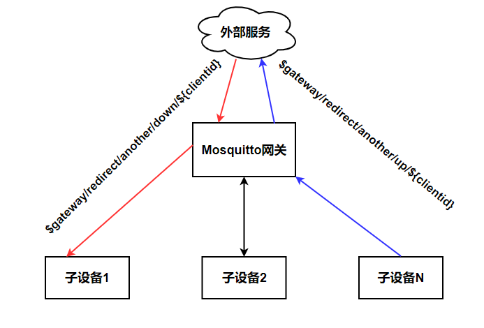

mosquitto 网关
==========================
本插件主要实现消息转发，将连接上来的客户端的消息转换成IOTHUB的格式，满足网关和子设备的功能需求。

## 编译
依赖: cjson, mosquitto, curl
```sh
make
```

## 配置
```conf
listener 1883
allow_anonymous true
plugin  ../plugins/mosquitto-http-plugin/edge_mqtt_gateway.so

```
## 代理上线
每当子设备连接到网关，网关会向远程Topic `$gateway/operation`发送一个消息：
```json
{
  "type": "online",
  "payload": {
    "devices": [
      {
        "key": "sub-device"
      }
    ]
  }
}
```
## 代理下线
每当子设备从网关断连，网关会向远程Topic `$gateway/operation`发送一个消息：
```json
{
  "type": "offline",
  "payload": {
    "devices": [
      {
        "key": "sub-device"
      }
    ]
  }
}
```
## 代理消息发布
每当子设备发布消息，网关代替子设备会向远程Topic `$gateway/operation`发送一个消息：
```json
{
  "type": "message_publish",
  "payload": {
    "from_client_id":"client_id",
    "from_username":"username",
    "topic":"$gateway/redirect/another/down/client_id",
    "qos":0,
    "retain":true,
    "payload":"Hello world!",
    "ts":1492412774
   }
}
```
## KEY 算法示例
子设备的KEY需要一个计算过程：
```lua
local deviceInfo = {
    clientid = "demo"
    uaername = "demo"
    productid = "demo"
    devicename = "demo"
}
local key = misc.encodeJwt("private-key-from-iothub", deviceInfo)
```
其中`private-key-from-iothub`字段来自任何一个外部平台颁发,这么做个好处就是和平台无关，由具体的业务来定义。

## 消息桥接
此插件需要配合桥接功能使用。
```conf
cleansession true
connection another-broker
remote_clientid test1
remote_username test1
remote_password test1
address 127.0.0.1:1883
# 发送到 $gateway/redirect/another/up 的消息会被转发到远程Broker
topic $gateway/redirect/another/up both 1 $gateway/operation
```
## 子设备Topic树

- 子设备需要订阅网关的特殊Topic: `$gateway/redirect/another/down/${clientid}`
- 子设备需要发布的特殊Topic: `$gateway/redirect/another/up/${clientid}`